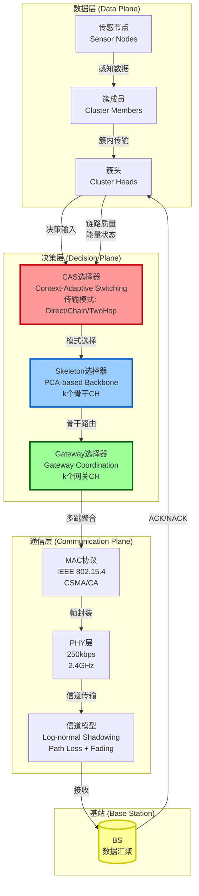
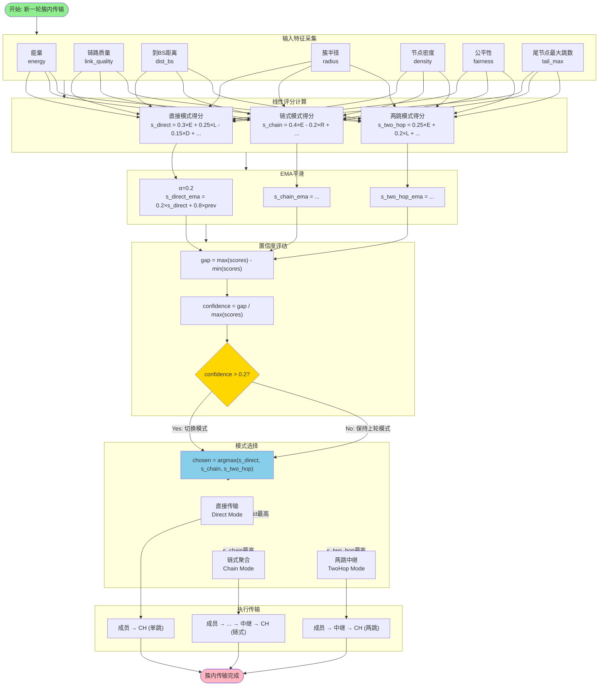
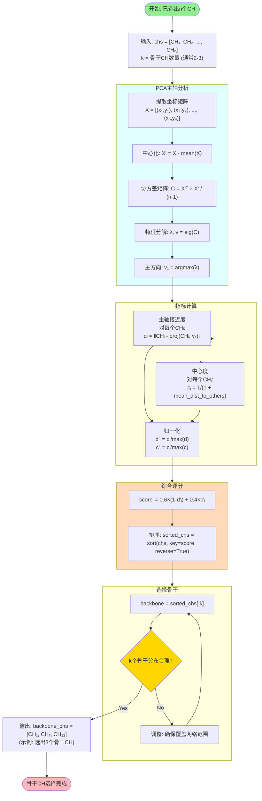
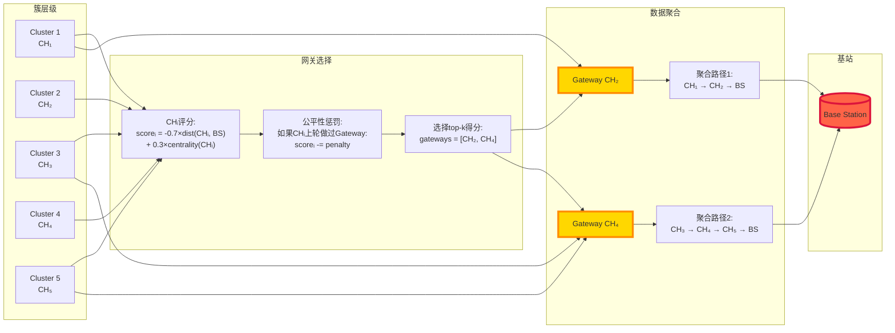
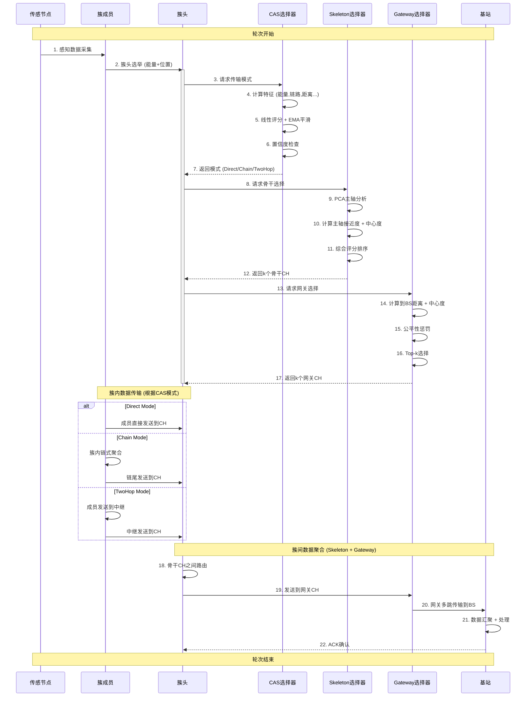
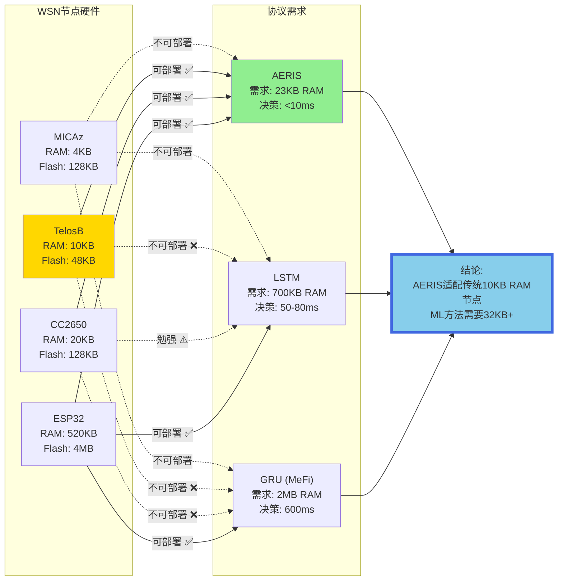

# AERIS架构图设计文档

**日期**: 2025-10-19
**作者**: Claude
**目的**: 为论文创建高质量的架构和流程图

---

## 图1: AERIS三层协同架构总览



---

## 图2: CAS决策流程详细展开



---

## 图3: Skeleton骨干选择流程



---

## 图4: Gateway网关选择与数据聚合



---

## 图5: 完整数据流时序图



---

## 图6: 与ML方法的架构对比

```mermaid
graph TB
    subgraph AERIS["AERIS架构 (确定性)"]
        A_Input[环境特征]
        A_CAS[线性评分<br/>51次浮点运算<br/>O(1)]
        A_SK[PCA分析<br/>O(n²)]
        A_GW[Top-k选择<br/>O(n²)]
        A_Output[路由决策]
        A_Time["总时间: <10ms"]
        A_Mem["内存: 23KB"]

        A_Input --> A_CAS --> A_SK --> A_GW --> A_Output
        A_Output -.-> A_Time
        A_Output -.-> A_Mem
    end

    subgraph LSTM["LSTM架构 (数据驱动)"]
        L_Input[历史序列<br/>128步]
        L_Encode[特征编码<br/>O(L·H)]
        L_LSTM[2层LSTM<br/>67M FLOPs<br/>O(L·H²)]
        L_FC[全连接层<br/>O(H)]
        L_Output[环境预测]
        L_Time["总时间: 50-80ms"]
        L_Mem["内存: 700KB"]
        L_Train["训练: 16小时"]

        L_Input --> L_Encode --> L_LSTM --> L_FC --> L_Output
        L_Output -.-> L_Time
        L_Output -.-> L_Mem
        L_Output -.-> L_Train
    end

    subgraph GRU["GRU架构 (MeFi)"]
        G_Input[状态空间]
        G_Encode[特征工程]
        G_GRU[GRU网络<br/>500K参数]
        G_Search[动作空间搜索]
        G_Output[路由策略]
        G_Time["总时间: 600ms"]
        G_Mem["内存: 2MB"]
        G_Train["训练: 48小时"]

        G_Input --> G_Encode --> G_GRU --> G_Search --> G_Output
        G_Output -.-> G_Time
        G_Output -.-> G_Mem
        G_Output -.-> G_Train
    end

    Compare["对比:<br/>AERIS快6-60倍<br/>省30-100倍内存<br/>零训练开销"]

    AERIS -.-> Compare
    LSTM -.-> Compare
    GRU -.-> Compare

    style A_Output fill:#90EE90
    style L_Output fill:#FFB6C1
    style G_Output fill:#FFD700
    style Compare fill:#87CEEB,stroke:#4169E1,stroke-width:4px
```

---

## 图7: 可部署性对比 (硬件视角)



---

## 使用说明

### 生成高质量图片

1. **Mermaid在线编辑器**: https://mermaid.live/
   - 复制上述代码
   - 导出为SVG (矢量图，无损缩放)
   - 或导出为PNG (600+ DPI)

2. **VS Code插件**: Mermaid Preview
   - 安装 "Markdown Preview Mermaid Support"
   - 直接渲染查看
   - 右键导出图片

3. **命令行工具** (需要npm):
   ```bash
   npm install -g @mermaid-js/mermaid-cli
   mmdc -i diagram.mmd -o output.svg -w 1920 -H 1080
   ```

### 论文插入建议

| 图编号 | 建议位置 | 说明 |
|-------|---------|------|
| 图1 | Section 3 (System Model) | 架构总览 |
| 图2 | Section 4.2 (CAS Design) | CAS详细流程 |
| 图3 | Section 4.3 (Skeleton) | Skeleton算法 |
| 图4 | Section 4.4 (Gateway) | Gateway选择 |
| 图5 | Section 4.5 (Pipeline) | 时序流程 |
| 图6 | Section 6.4 (Comparison) | 性能对比 |
| 图7 | Section 7 (Discussion) | 可部署性分析 |

---

## 图表风格统一

### 颜色方案 (保持学术专业性)

- **AERIS组件**: #90EE90 (浅绿) - 代表轻量高效
- **决策节点**: #FFD700 (金色) - 代表关键决策点
- **ML方法**: #FFB6C1 (粉红) - 代表计算密集
- **基站/结果**: #87CEEB (天蓝) - 代表最终输出

### 字体建议

- 图表文字: Arial 或 Helvetica (10-12pt)
- 标题: 粗体 (12-14pt)
- 注释: 斜体 (9-10pt)

---

**下一步**: 使用Mermaid Live渲染这些图表，生成高分辨率SVG/PNG插入论文 🚀
