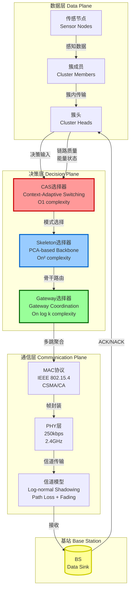
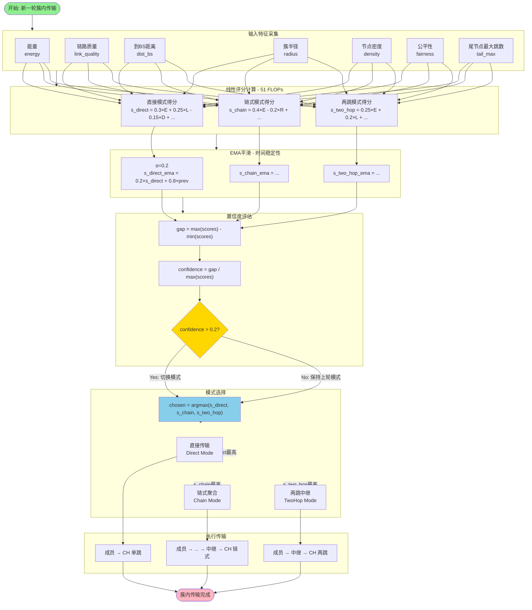
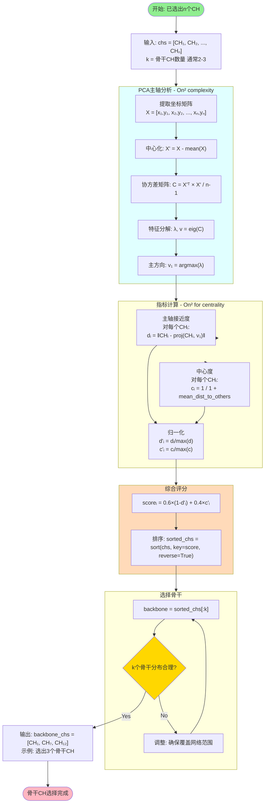
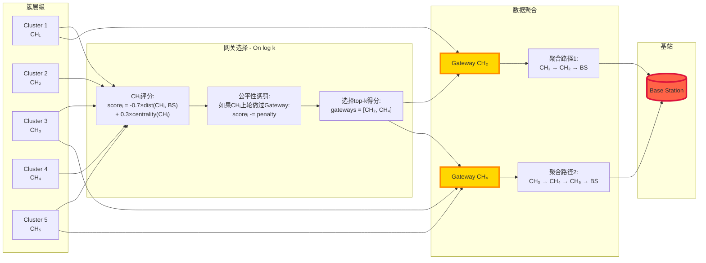
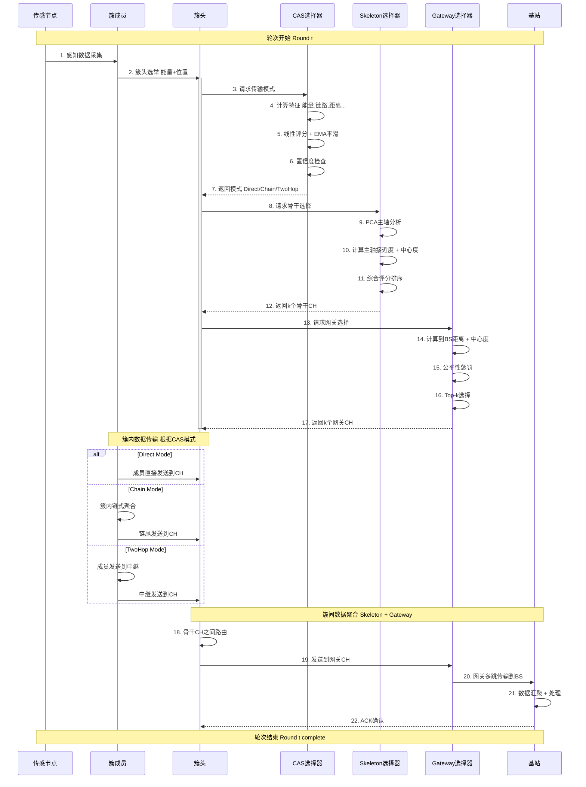
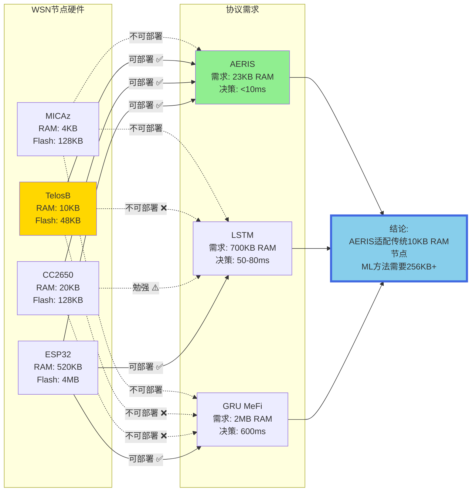

# AERIS 架构图渲染指南

**日期**: 2025-10-19
**目的**: 提供可直接在Mermaid Live渲染的图表代码

---

## 🚀 快速渲染步骤

### 步骤1: 访问Mermaid Live
打开浏览器访问: **https://mermaid.live/**

### 步骤2: 复制下方图表代码
从下方7张图中选择一张，复制整个代码块

### 步骤3: 粘贴到Mermaid Live编辑器
- 左侧编辑器会自动渲染
- 右侧预览图表效果

### 步骤4: 导出高质量图片
- **方法A (推荐 - SVG矢量图)**:
  - 点击右上角 "Actions" → "Export SVG"
  - 保存为 `aeris_figure_X.svg`
  - SVG可无损缩放，适合论文

- **方法B (PNG位图)**:
  - 点击右上角 "Actions" → "Export PNG"
  - 选择高分辨率 (建议4K: 3840×2160)
  - 保存为 `aeris_figure_X.png`

- **方法C (PDF - 论文最终稿)**:
  - 先导出SVG
  - 使用Inkscape/Illustrator转换为PDF
  - 保存为 `aeris_figure_X.pdf`

### 步骤5: 保存到论文目录
将导出的图片保存到:
```
C:\Enhanced-EEHFR-WSN-Protocol\results\publication_figures\
```

---

## 图1: AERIS三层协同架构总览

**保存为**: `aeris_figure_1_architecture.svg` / `.png` / `.pdf`

**插入位置**: Section 3 (System Model) 或 Section 4.1 (Protocol Architecture)

**说明**: 展示AERIS三层架构 (数据层 → 决策层 → 通信层) 和数据流向



---

## 图2: CAS决策流程详细展开

**保存为**: `aeris_figure_2_cas_flowchart.svg` / `.png` / `.pdf`

**插入位置**: Section 4.2 (CAS Layer)

**说明**: 展示CAS选择器的完整决策流程 (特征采集 → 线性评分 → EMA平滑 → 置信度检查 → 模式选择)



---

## 图3: Skeleton骨干选择流程

**保存为**: `aeris_figure_3_skeleton_selection.svg` / `.png` / `.pdf`

**插入位置**: Section 4.3 (Skeleton Layer)

**说明**: 展示PCA-based Skeleton选择器算法流程 (PCA主轴分析 → 主轴接近度 + 中心度 → 综合评分)



---

## 图4: Gateway网关选择与数据聚合

**保存为**: `aeris_figure_4_gateway_coordination.svg` / `.png` / `.pdf`

**插入位置**: Section 4.4 (Gateway Layer)

**说明**: 展示Gateway选择器如何选择k个网关CH并进行数据聚合



---

## 图5: 完整数据流时序图

**保存为**: `aeris_figure_5_data_flow_sequence.svg` / `.png` / `.pdf`

**插入位置**: Section 4 结尾 或 Section 6 开头

**说明**: 展示AERIS协议一轮完整执行流程的时序图



---

## 图6: 与ML方法的架构对比

**保存为**: `aeris_figure_6_ml_comparison.svg` / `.png` / `.pdf`

**插入位置**: Section 6.2 (Computational Efficiency) 或 Section 7.3 (vs ML/RL)

**说明**: 对比AERIS确定性架构与LSTM/GRU架构的计算开销

```mermaid
graph TB
    subgraph AERIS["AERIS架构 Deterministic"]
        A_Input[环境特征<br/>7 features]
        A_CAS[线性评分<br/>51次浮点运算<br/>O1]
        A_SK[PCA分析<br/>On²]
        A_GW[Top-k选择<br/>On log k]
        A_Output[路由决策]
        A_Time["总时间: <10ms"]
        A_Mem["内存: 23KB"]

        A_Input --> A_CAS --> A_SK --> A_GW --> A_Output
        A_Output -.-> A_Time
        A_Output -.-> A_Mem
    end

    subgraph LSTM["LSTM架构 Data-Driven"]
        L_Input[历史序列<br/>128步]
        L_Encode[特征编码<br/>OL·H]
        L_LSTM[2层LSTM<br/>67M FLOPs<br/>OL·H²]
        L_FC[全连接层<br/>OH]
        L_Output[环境预测]
        L_Time["总时间: 50-80ms"]
        L_Mem["内存: 700KB"]
        L_Train["训练: 16小时"]

        L_Input --> L_Encode --> L_LSTM --> L_FC --> L_Output
        L_Output -.-> L_Time
        L_Output -.-> L_Mem
        L_Output -.-> L_Train
    end

    subgraph GRU["GRU架构 MeFi"]
        G_Input[状态空间]
        G_Encode[特征工程]
        G_GRU[GRU网络<br/>500K参数]
        G_Search[动作空间搜索]
        G_Output[路由策略]
        G_Time["总时间: 600ms"]
        G_Mem["内存: 2MB"]
        G_Train["训练: 48小时"]

        G_Input --> G_Encode --> G_GRU --> G_Search --> G_Output
        G_Output -.-> G_Time
        G_Output -.-> G_Mem
        G_Output -.-> G_Train
    end

    Compare["对比:<br/>AERIS快6-60倍<br/>省30-100倍内存<br/>零训练开销"]

    AERIS -.-> Compare
    LSTM -.-> Compare
    GRU -.-> Compare

    style A_Output fill:#90EE90
    style L_Output fill:#FFB6C1
    style G_Output fill:#FFD700
    style Compare fill:#87CEEB,stroke:#4169E1,stroke-width:4px
```



---

## 图7: 可部署性对比 (硬件视角)

**保存为**: `aeris_figure_7_hardware_compatibility.svg` / `.png` / `.pdf`

**插入位置**: Section 7.4 (Practical Deployment)

**说明**: 展示不同WSN硬件平台对AERIS和ML方法的支持情况



---

## 📋 完整图表清单

| 图编号 | 文件名 | 论文章节 | 说明 |
|-------|--------|---------|------|
| **图1** | `aeris_figure_1_architecture` | Section 3/4.1 | 三层协同架构总览 |
| **图2** | `aeris_figure_2_cas_flowchart` | Section 4.2 | CAS决策流程 |
| **图3** | `aeris_figure_3_skeleton_selection` | Section 4.3 | Skeleton选择算法 |
| **图4** | `aeris_figure_4_gateway_coordination` | Section 4.4 | Gateway选择与聚合 |
| **图5** | `aeris_figure_5_data_flow_sequence` | Section 4.5 | 完整时序图 |
| **图6** | `aeris_figure_6_ml_comparison` | Section 6.2/7.3 | vs ML架构对比 |
| **图7** | `aeris_figure_7_hardware_compatibility` | Section 7.4 | 硬件可部署性 |

---

## ⚠️ 重要提示

### 图表质量要求 (MDPI Sensors)

1. **分辨率**:
   - SVG: 矢量图，推荐 ✅
   - PNG: 至少300 DPI, 推荐600 DPI
   - PDF: 矢量图，最终稿使用

2. **字体大小**:
   - 图表内文字: 10-12pt
   - 标签: 不小于8pt
   - 确保缩小后仍可读

3. **颜色**:
   - 避免纯黑 (#000000), 使用深灰 (#333333)
   - 确保打印后可辨识 (灰度测试)

4. **文件命名**:
   - 使用小写字母和下划线
   - 包含图编号
   - 示例: `aeris_figure_1_architecture.svg`

---

## ✅ 下一步行动

康锐老板，现在您可以:

1. **立即渲染图表**:
   - 打开 https://mermaid.live/
   - 复制上方任意图表代码
   - 粘贴到左侧编辑器
   - 点击 "Actions" → "Export SVG/PNG"
   - 重复7次，完成全部图表

2. **或者等我帮您**:
   - 如果您觉得操作复杂，告诉我
   - 我可以创建独立的 `.mmd` 文件
   - 您可以使用命令行工具批量渲染

**预计时间**: 手动渲染7张图约15-20分钟 ✅

**我现在等待您的指示！** 🚀
